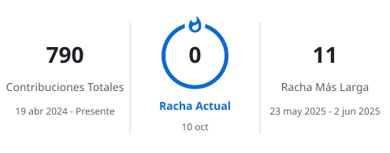

# Anderson Baca Chuquimanco

Estudiante de Ingeniería de Sistemas y Computación en la **USAT** · Chiclayo, Perú

---

### Sobre mí

- 🎓 9.º ciclo de Ingeniería de Sistemas y Computación — **USAT**
- ☕ Tesis: **CoffeeRen**, visión artificial para clasificar granos de café verde
- 🚀 Co-fundador de **INNOTTI S.A.C.**, donde desarrollamos **TURIFAST**
- 🌱 Aprendiendo: MLOps, visión computacional y arquitecturas backend

---

### Stack

| | |
|:--|:--|
| **Lenguajes** |      |
| **Backend** |    |
| **ML / Datos** |    |
| **Frontend** |  |
| **Herramientas** |     |

---

### Proyectos destacados

| Proyecto | Descripción | Stack |
|:--|:--|:--|
| **CoffeeRen** | Visión artificial para clasificar granos de café verde (tesis) | YOLO · FastAPI · Arduino · Python |
| **TURIFAST** | App móvil de turismo inteligente para Lambayeque | React Native · Spring Boot |
| **Anemia Dashboard** | Dashboard epidemiológico con datos abiertos del Perú | Power BI · Python |
| **Modelo Reintegración Social** | Regresión logística binaria con CRISP-ML | Python · scikit-learn |

---

### Estadísticas

<picture>
  <source media="(prefers-color-scheme: dark)" srcset="./profile/stats-dark.svg" />
  
</picture>
<picture>
  <source media="(prefers-color-scheme: dark)" srcset="./profile/top-langs-dark.svg" />
  
</picture>

<picture>
  <source media="(prefers-color-scheme: dark)" srcset="./profile/streak-dark.svg" />
  
</picture>

<picture>
  <source media="(prefers-color-scheme: dark)" srcset="https://github-readme-activity-graph.vercel.app/graph?username=BanderJ&bg_color=0D1117&color=8B949E&line=2F81F7&point=E6EDF3&area=true&area_color=2F81F7&hide_border=true&custom_title=Actividad%20reciente" />
  
</picture>

---
